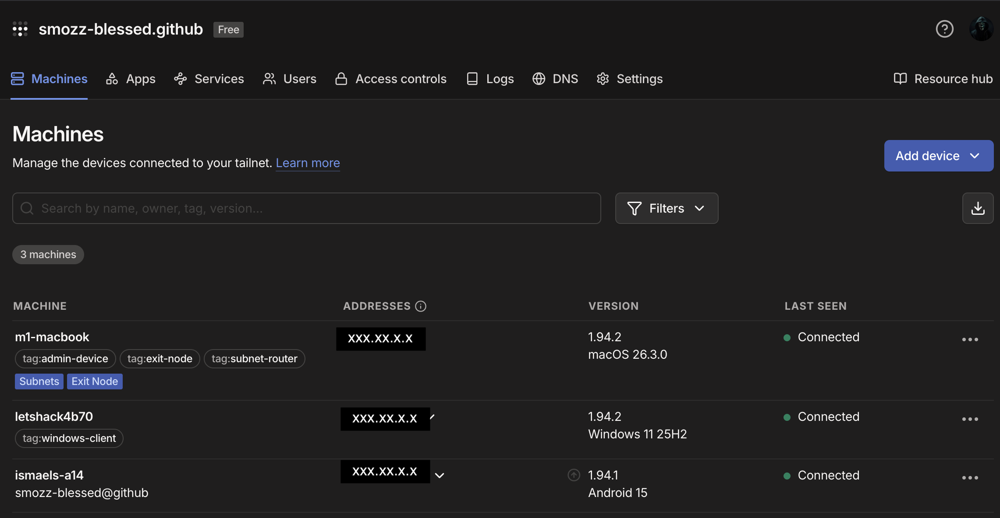
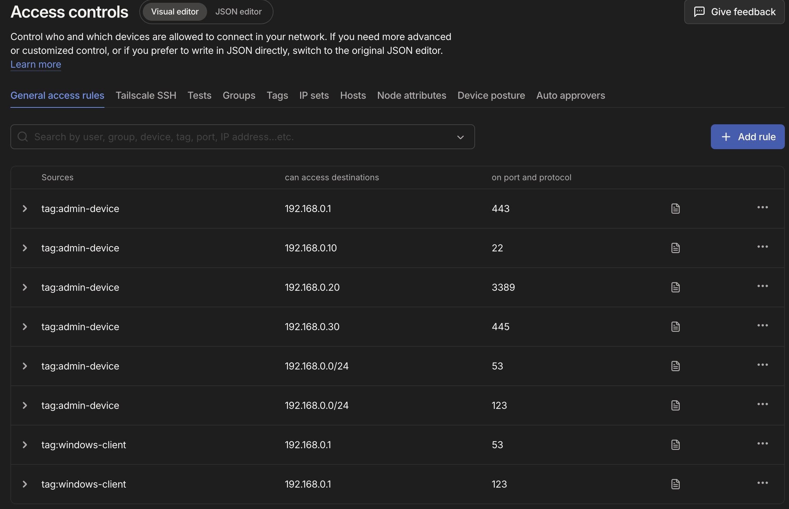
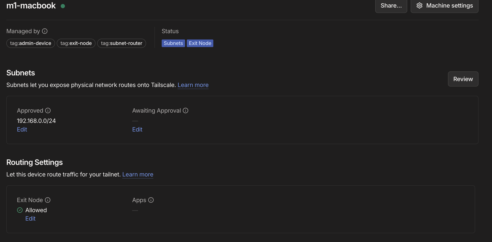
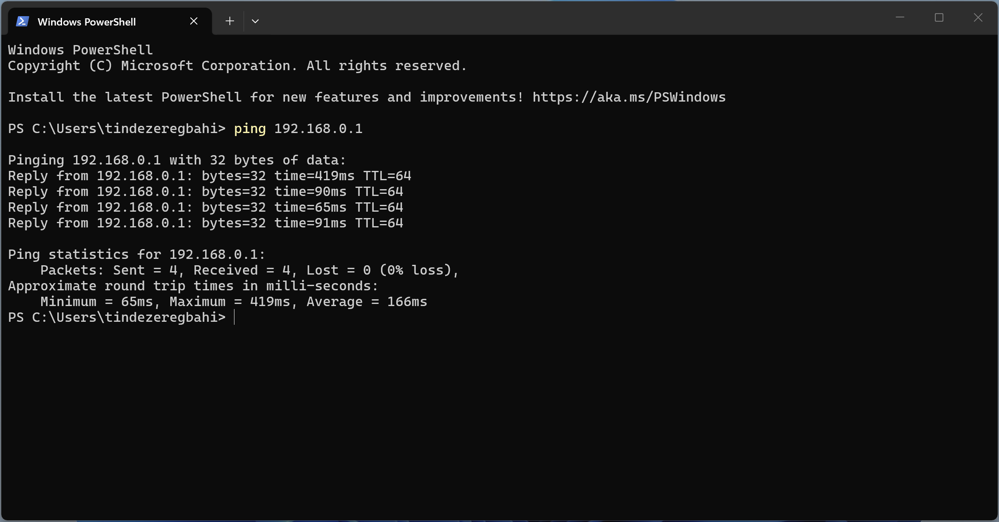
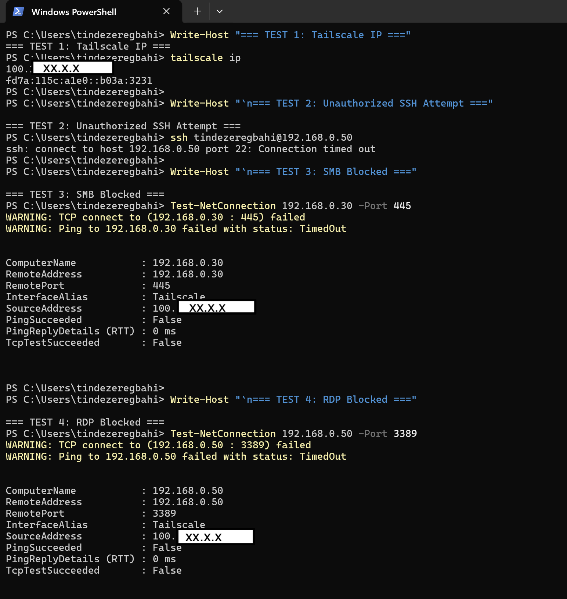

# Zero Trust Remote Access Homelab

## Secure Overlay Networking Architecture using Tailscale, WireGuard and Role-Based ACL Segmentation


---

## Overview

This project demonstrates a practical implementation of secure remote access networking using an overlay Zero Trust model.  
The architecture leverages encrypted communication tunnels, subnet routing, centralized internet egress via exit node configuration, and role-based access control.  
The lab simulates a small enterprise remote workforce security infrastructure connecting macOS, Windows VM, and Android devices.

---

## Outline

- [Title & Subtitle](#title--subtitle)
- [Introduction](#introduction)
- [Architecture Diagram](#architecture-diagram)
- [Installation (Users)](#installation-instructions-for-users)
- [Installation (Developers)](#installation-instructions-for-developers-lab-reproduction-details)
- [Security Model](#security-model)
- [Contributor Expectations](#contributor-expectations)
- [Known Issues](#known-issues)

---

## Title & Subtitle

**Zero Trust Remote Access Homelab with Tailscale (Subnet Router + Exit Node + ACL Segmentation)**  
Secure remote access architecture using Tailscale, WireGuard, subnet routing and exit node configuration across macOS, Windows 11 VM and Android with enterprise-style ACL enforcement.

---

## Introduction

This homelab demonstrates how to build a secure remote access architecture using Tailscale as a WireGuard-based overlay network.

The project includes:

- A **macOS** device acting as:
  - Subnet Router (`192.168.0.0/24`)
  - Exit Node (centralized internet egress)
- A **Windows 11 VM** acting as a remote client
- An **Android** device connected to the same tailnet
- Role-based access control (ACL) using tags
- Micro‑segmentation and least‑privilege network access

**Key Concepts Implemented**

- Zero Trust Networking
- Encrypted overlay network
- Subnet routing
- Exit node routing
- Micro‑segmentation via ACL
- Centralized egress
- Device role separation

This setup simulates a small enterprise remote workforce architecture where remote devices securely access internal LAN resources and optionally route all internet traffic through a central gateway.

---

## Architecture Diagram

```
                Internet
                    |
               Public IP
                    |
               [ macOS ]
        (Subnet Router + Exit Node)
                    |
          -----------------------
          |                     |
     192.168.0.0/24         Tailscale
          |                     |
     Home LAN            Encrypted Tunnel
                                |
                       ------------------
                       |                |
                 Windows 11 VM       Android
                (Remote Client)   (Mobile Client)

Traffic flows:
Windows → Encrypted tunnel → macOS → LAN or Internet
Android → Encrypted tunnel → macOS → LAN
```

---

## 📸 Screenshots & Validation

### 🔹 Admin Console – Devices Overview

The tailnet devices are segmented using tags to enforce a Zero Trust access model.



---

### 🔹 Hardened Zero Trust ACL

Explicit service-level permissions are defined using device tags and least privilege principles.



---

### 🔹 Subnet Router & Exit Node Configuration

Subnet routing (192.168.0.0/24) and exit node (0.0.0.0/0) are approved and enforced.



---

### 🔹 Connectivity Test

Successful LAN connectivity test from the Windows client through the subnet router.



---

## 🔎 Security Validation & Testing

The following validation demonstrates enforcement of the hardened Zero Trust ACL model:

- ✔ Successful Tailscale authentication  
- ✔ Approved subnet routing  
- ✔ Explicit service-level access control  
- ❌ Unauthorized lateral movement blocked  



These results confirm proper implementation of device tagging, subnet routing, exit node configuration, and least privilege access control.

---

## Installation Instructions for Users

This section describes how to reproduce the lab.

### Requirements

- macOS device
- Windows 11 VM (Parallels or similar)
- Android device
- Tailscale account (GitHub SSO used in this lab)

### Step 1 – Install Tailscale on macOS

- Install [Tailscale](https://tailscale.com/download)
- Log in using GitHub
- Enable:
  - Subnet Router for `192.168.0.0/24`
  - Exit Node (`0.0.0.0/0`)

Command used:

```bash
sudo tailscale up --advertise-routes=192.168.0.0/24 --advertise-exit-node --accept-routes
```

Approve routes and exit node in [Admin Console](https://login.tailscale.com/admin/machines).

### Step 2 – Install Tailscale on Windows 11 VM

- Install Tailscale
- Log in to same tailnet
- Assign tag: `tag:windows-client`
- Select macOS device as Exit Node
- Enable LAN access if required

**Validation:**

```cmd
tracert 8.8.8.8
```
First hop should be the macOS device (Tailscale interface).

Check public IP:
```cmd
curl ifconfig.me
```
It should match the macOS public IP.

### Step 3 – Android Device

- Install Tailscale from Play Store
- Connect to same tailnet
- Assign appropriate tag (e.g., `tag:android`)
- Validate remote access to LAN
- Optional: test exit node usage

---

## Installation Instructions for Developers (Lab Reproduction Details)

### ACL Configuration

Enterprise-style ACL with role-based segmentation:

- `tag:admin-device`
- `tag:subnet-router`
- `tag:exit-node`
- `tag:windows-client`

**Security model includes:**

- Least privilege access
- Port‑restricted LAN access
- Controlled route auto‑approval
- Separation of device roles

**Routes auto‑approved:**

- `192.168.0.0/24` (Subnet Router)
- `0.0.0.0/0` and `::/0` (Exit Node)

**Micro‑segmentation example:**

Windows client allowed access to specific ports on the LAN:

| Port | Service  |
|------|----------|
| 53   | DNS      |
| 123  | NTP      |

No global `*:*` access except where strictly required.

---

## Security Model

This homelab implements:

- **Encrypted Overlay Network** – All device‑to‑device communication is end‑to‑end encrypted using WireGuard.
- **Zero Trust Approach** – No implicit trust between devices; access is defined explicitly via ACL rules and tags.
- **Centralized Internet Egress** – Remote clients route internet traffic through a trusted exit node (macOS device).
- **Micro-Segmentation** – Windows VM and remote clients are restricted to authorized services only. Administrative and management interface access is limited to trusted admin-tagged devices following Zero Trust policy enforcement.
- **Controlled Route Advertisement** – Only authorized devices can advertise subnet or exit routes.

---

## Contributor Expectations

This repository is a documentation‑focused homelab project.

Contributions are welcome in the form of:

- Improved diagrams
- Security hardening suggestions
- Cross‑platform validation (Linux, iOS)
- Threat model documentation
- Performance benchmarking

**Keep contributions:**

- Focused
- Security‑oriented
- Production‑relevant
- Minimal and noise‑free

**Avoid:**

- Over‑explaining basics
- Outdated screenshots
- Redundant documentation

---

## Known Issues

- Android UI may not always display exit node correctly.
- Bridged VM networking can create false‑positive LAN access results.
- Exit node must be manually selected (not automatic).
- Public IP remains visible to external websites (this is not an anonymity tool).

---

*If you want to understand secure remote access architecture, zero trust segmentation, and encrypted overlay networking in a practical hands‑on lab, this project demonstrates a complete working example.*